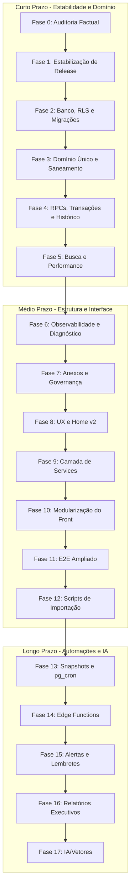

# Plano Ampliado de Evolução do Projeto — Controle de Climatização (3ª CRE / GOP)

Este plano consolida as sugestões técnicas das auditorias do Claude Code, Supabase AI, GitHub Copilot, Codex, Antigravity e a estratégia do Usuário. Ele separa a **execução imediata de curto prazo** da **evolução técnica e de infraestrutura de médio e longo prazo**, mitigando riscos e garantindo a estabilidade da aplicação em todas as fases.

---

## 1. Visão Geral por Horizonte de Execução



---

## 2. Detalhamento das Fases

### HORIZONTE 1: CURTO PRAZO — ESTABILIDADE E SEGURANÇA CONTROLADA

#### Fase 0 — Auditoria Factual de Estado Real (CONCLUÍDO)
*   **Objetivo:** Obter uma fonte única de verdade factual das configurações e código.
*   **Resultados:** Relatório de auditoria e matriz de evidências salvos em [estado-real-projeto-2026-06.md](file:///C:/Users/okidata/.gemini/antigravity-ide/scratch/controle-climatizacao-3cre/docs/auditorias/estado-real-projeto-2026-06.md).

#### Fase 1 — Estabilização e Governança de Release (CONCLUÍDO)
*   **Objetivo:** Consolidar a base de código e garantir regressão zero.
*   **Resultados:** Suite local de 85 testes, 40 testes de dossiê, 8 smoke tests e 3 Playwright E2E validados e executados 100% verde com build ativo.

#### Fase 2 — Banco, RLS e Migrações (Aguardando PR 1)
*   **Objetivo:** Configurar **RLS público-controlado para aplicação sem login**, garantindo integridade e compatibilidade com o tráfego anônimo atual, aplicando as migrations pendentes.
*   **Restrições e Decisões de Projeto:**
    *   **Sem Autenticação:** O projeto opera permanentemente sem autenticação, tela de login, perfis de usuário ou controle por pessoa.
    *   **Prevenção de DELETE público amplo:** Não serão criadas policies de `DELETE` para a role `anon`. O RLS na tabela `chamados` será postergado até que o rollback por exclusão de chamado no front seja removido e convertido para a RPC transacional `create_ticket_with_history` (Fase 4).
    *   **Políticas:** Configurar policies públicas explícitas (`TO anon, authenticated`) apenas para `SELECT`, `INSERT` e `UPDATE` onde estritamente necessário.
    *   **Migrations:** Reconciliar o CLI com a migration fantasma `20260606223400_security_hardening` criando o arquivo de compatibilidade correspondente no repositório. E aplicar as migrations locais pendentes (`20260607043000`, `20260607044500`, `20260607190000`).
*   *Entregável:* `PR 1 — Banco/RLS/Migrations` (Sem visual ou CSS).

#### Fase 3 — Domínio Único e Saneamento de Dados (Aguardando PR 2)
*   **Objetivo:** Centralizar a taxonomia de status, setores e prioridades no frontend e banco de dados.
*   **Ações:**
    1.  Criar os catálogos de domínio: `statuses.js`, `sectors.js`, `priorities.js`, `aptidao.js` em `src/domain/`.
    2.  Executar queries de diagnóstico e saneamento de valores incoerentes gravados no banco Supabase.
    3.  Aplicar `CHECK constraints` nas colunas do banco remoto para bloquear variações de strings inválidas.
*   *Entregável:* `PR 2 — Domínio e saneamento de dados`

#### Fase 4 — RPCs, Transações e Histórico (Aguardando PR 3)
*   **Objetivo:** Garantir a consistência das alterações e logs na linha do tempo, eliminando a necessidade de rollbacks via front.
*   **Ações:**
    1.  Criar RPC transacional `create_ticket_with_history` para substituir os inserts manuais do front, eliminando a necessidade de rollback via `delete()`.
    2.  Padronizar: `modificado_em` como timestamp técnico do banco; `historico.data` como data real do evento; e `ultima_movimentacao` como resumo operacional humano.
    3.  Registrar criação, edição e remoção de anexos no histórico.
*   *Entregável:* `PR 3 — Histórico, RPCs e anexos`

#### Fase 5 — Busca, Índices e Performance de Consulta (Aguardando PR 4)
*   **Objetivo:** Otimizar e tolerar acentos nas pesquisas da UI.
*   **Ações:**
    1.  Otimizar o seletor da aba de Comunicações com busca pesquisável de chamados.
    2.  Adicionar índices de performance candidatos:
        ```sql
        CREATE INDEX idx_chamados_status_modificado ON chamados(status_atual, modificado_em);
        CREATE INDEX idx_chamados_setor_modificado ON chamados(setor_responsavel, modificado_em);
        CREATE INDEX idx_chamados_designacao_modificado ON chamados(designacao, modificado_em);
        CREATE INDEX idx_historico_id_data ON historico(id_chamado, data DESC);
        ```
*   *Entregável:* `PR 4 — Busca e filtros`

---

### HORIZONTE 2: MÉDIO PRAZO — ESTRUTURA E INTERFACE

#### Fase 6 — Observabilidade e Diagnóstico Operacional
*   **Objetivo:** Tela administrativa somente leitura reportando a saúde da base (órfãos, status inválidos, datas nulas).
*   **Ações:** Consolidar a view `vw_integridade_operacional` na UI de diagnóstico do Admin.

#### Fase 7 — Anexos e Governança Documental
*   **Objetivo:** Rastreabilidade e classificação de documentos anexados (laudos, fotos, vistorias).

#### Fase 8 — UX e Home v2
*   **Objetivo:** Layout **"Herói Dividido"** (Mapa grande à esquerda, KPIs verticais em trilha compacta à direita, donut e lista na base) rodando isoladamente em branch própria (`visual/home-v2`) sem afetar o banco.

#### Fase 9 — Camada de Services
*   **Objetivo:** Extrair consultas SQL e Supabase do React para arquivos de serviços puros (`src/services/`).

#### Fase 10 — Modularização Progressiva do Frontend
*   **Objetivo:** Fragmentar e reduzir o tamanho do [App.jsx](file:///C:/Users/okidata/.gemini/antigravity-ide/scratch/controle-climatizacao-3cre/src/App.jsx) extraindo páginas e modais (`DashboardPage.jsx`, `SchoolDossier.jsx`, etc.).

#### Fase 11 — Testes E2E Ampliados
*   **Objetivo:** Criar testes de interface ponta a ponta (Playwright) para todos os caminhos felizes e tristes da aplicação.

#### Fase 12 — Scripts de Importação e Reprodutibilidade
*   **Objetivo:** Scripts documentados para importação e snapshots locais (`scripts/import/`).

---

### HORIZONTE 3: LONGO PRAZO — AUTOMAÇÕES E IA

#### Fase 13 — Snapshots e pg_cron
*   **Objetivo:** Jobs agendados semanais gravando a tendência de passivos em `operational_snapshots`.

#### Fase 14 — Edge Functions
*   **Objetivo:** Processamento de webhooks de Microsoft Forms, envio de e-mail de servidor ou geração de PDFs executivos.

#### Fase 15 — Alertas e Lembretes
*   **Objetivo:** Avisos visuais ao ultrapassar faixas críticas de inércia e antiguidade.

#### Fase 16 — Relatórios Executivos
*   **Objetivo:** Geração de relatórios gerenciais focados em bairros ou setores.

#### Fase 17 — IA/Vetores
*   **Objetivo:** Backlog distante para busca semântica em logs de histórico. Não implementar no momento.
